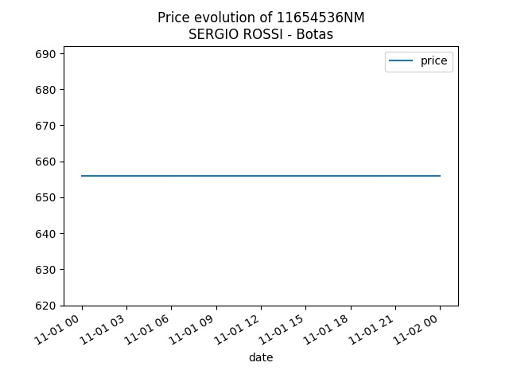

  

  	<table>
		<thead>
			<th>
				 
			</th>
			<th colspan="2">
				<a href="https://www.yoox.com/es/11654536NM/item">SERGIO ROSSI - Botas</a>
			</th>
		</thead>
		<thead style="border: 1px solid #696969;">
			<th>Tipo de precio</th>
			<th>Precio</th>
			<th>Fecha</th>
		</thead>
		<tbody>
			<tr>
				<td>Máx.</td>
				<td>EUR656</td>
				<td>01 Nov 2020</td>	
			</tr>
			<tr>
				<td>Min.</td>
				<td>EUR656</td>
				<td>01 Nov 2020</td>	
			</tr>
		</tbody>
	</table>
  

  

  	
  

