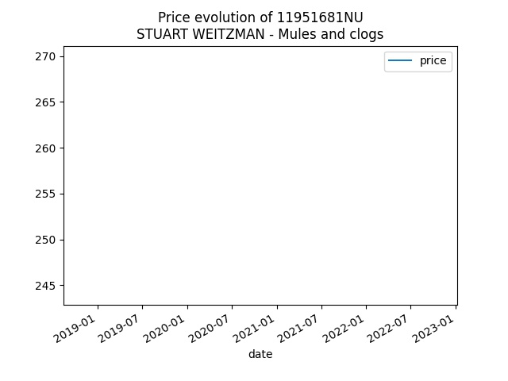

  

  	<table>
		<thead>
			<th>
				 
			</th>
			<th colspan="2">
				<a href="https://www.yoox.com/uk/11951681NU/item">STUART WEITZMAN - Mules and clogs</a>
			</th>
		</thead>
		<thead style="border: 1px solid #696969;">
			<th>Price type</th>
			<th>Price</th>
			<th>Date</th>
		</thead>
		<tbody>
			<tr>
				<td>Max</td>
				<td>£257</td>
				<td>26 Oct 2020</td>	
			</tr>
			<tr>
				<td>Min</td>
				<td>£257</td>
				<td>26 Oct 2020</td>	
			</tr>
		</tbody>
	</table>
  

  

  	
  

